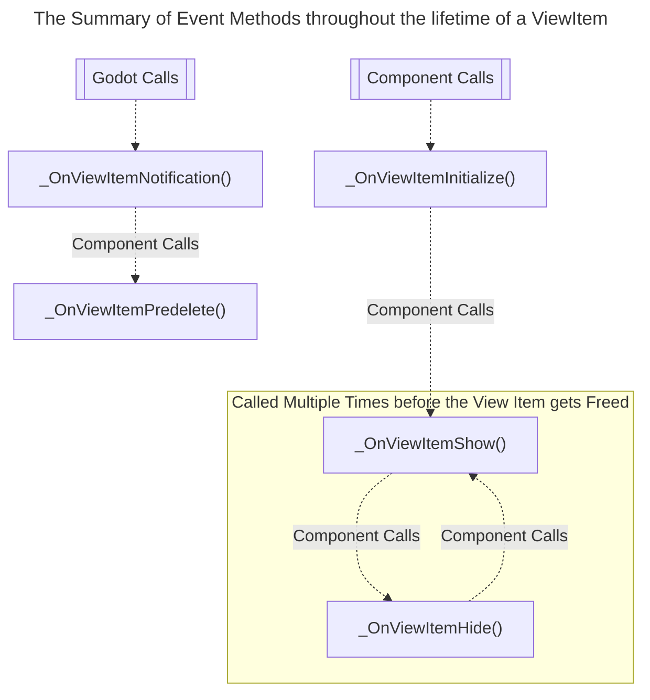

# GDViews.FreeTabView

## Introduction

Supports in `Godot 4.1+` with .Net module.  
***GDViews.FreeTabView*** is a `Godot 4` UI Component that's useful for creating highly customizable tab views.  

## Installation

For .Net CLI

```txt
dotnet add package GDViews.FreeTabView
```

For Package Manager Console

```txt
NuGet\Install-Package GDViews.FreeTabView
```

For `csproj` PackageReference

```xml
<PackageReference Include="GDViews.FreeTabView" Version="*" />
```

---

<!-- START doctoc generated TOC please keep comment here to allow auto update -->
<!-- DON'T EDIT THIS SECTION, INSTEAD RE-RUN doctoc TO UPDATE -->
## Table of Contents

- [Glossarys](#glossarys)
  - [`FreeTabView / TabView`](#freetabview--tabview)
  - [`FreeTabViewItem / TabViewItem`](#freetabviewitem--tabviewitem)
- [API Usage](#api-usage)
  - [Creating a `ViewItem`](#creating-a-viewitem)
    - [A Simple Example](#a-simple-example)
    - [A Complex Example](#a-complex-example)
  - [Creating a `TabView`](#creating-a-tabview)
    - [Create from existing `ViewItem` Instances](#create-from-existing-viewitem-instances)
    - [Create from `PackedScenes`](#create-from-packedscenes)
- [Component Documentation](#component-documentation)
  - [The `FreeTabView`](#the-freetabview)
    - [Static Factory Methods](#static-factory-methods)
      - [`FreeTabView.CreateFromPrefab`](#freetabviewcreatefromprefab)
      - [`FreeTabView.CreateFromInstance`](#freetabviewcreatefrominstance)
    - [Instance Methods](#instance-methods)
      - [`Show(int index)` / `Show(int index, object? optionalArg)`](#showint-index--showint-index-object-optionalarg)
      - [`ShowNext` / `ShowPrevious`](#shownext--showprevious)
    - [`ArgumentResolver`](#argumentresolver)
      - [Default Resolver](#default-resolver)
      - [Resolver for `ShowNext` / `ShowPrevious`](#resolver-for-shownext--showprevious)
  - [The `FreeTabViewItem` / `FreeTabViewItemT`](#the-freetabviewitem--freetabviewitemt)
    - [Event Methods Diagram](#event-methods-diagram)
  - [ViewItemTweeners](#viewitemtweeners)
    - [Built-in Tweeners](#built-in-tweeners)
    - [Customize Tweeners](#customize-tweeners)

<!-- END doctoc generated TOC please keep comment here to allow auto update -->

---

## Glossarys

### `FreeTabView / TabView`

The C# type that controls a group of associated `TabViewItem` and handles the tab view behavior; it provides common functionality such as switching `ViewItems` from code or `Tabs` similar to a `TabContainer`, as well as passing `showing/hiding` events to `ViewItems`.

### `FreeTabViewItem / TabViewItem`

The script(s) inheriting the `FreeTabViewItem` or `FreeTabViewItemT`, attaching the script to a control to make it a `TabViewItem`, developer may create a `FreeTabView` from a collection of `FreeTabViewItem`s.

## API Usage

### Creating a `ViewItem`

Attach the following script to a `Control` to make it a view item.  

#### A Simple Example

This view item displays the current system time.

```csharp
using Godot;
using GodotViews;

/// <summary>
/// Attach this script to a <see cref="Control"/> to make it a ViewItem.
/// </summary>
public partial class MyViewItem : FreeTabViewItem
{
    [Export] private Label _text;

    public override void _Process(double delta)
    {
        base._Process(delta);
        _text.Text = Time.GetTimeStringFromSystem();
    }
}
```

#### A Complex Example

This view item displays `Hello World!` when shown, and shows `Click: Number` when clicking the `_pressButton`.

```csharp
using Godot;

/// <summary>
/// Attach this script to a <see cref="Control"/> to make it a ViewItem.
/// </summary>
public partial class MyViewItem2 : FreeTabViewItem
{
    [Export] private Label _text;
    [Export] private Button _pressButton;

    private int _clickCount;
    
    /// <summary>
    /// Called when the <see cref="FreeTabView"/> is initializing the view item.
    /// </summary>
    protected override void _OnViewItemInitialize()
    {
        _pressButton.Pressed += () => _text.Text = $"Clicked: {_clickCount++}";
    }

    /// <summary>
    /// Called when the <see cref="FreeTabView"/> is showing the view item.
    /// </summary>
    protected override void _OnViewShow()
    {
        _text.Text = "Hello World!";
        _pressButton.GrabFocus();
    }
}
```

### Creating a `TabView`

The `FreeTabView` is pure C# implementation, so instead of attaching a script to a node in the scene tree, developers need to create and use it in scripts, there are two ways for constructing a `FreeTabView` instance.

#### Create from existing `ViewItem` Instances

For use cases where the developer wishes to instantiate their instance of `ViewItem`, or simply leave them in the scene tree, `FreeTabView.CreateFromInstance` can be used to construct the `FreeTabView`.

```csharp
using Godot;

/// <summary>
/// Attached to a node in scene tree.
/// </summary>
public partial class Main : Node
{
    // Assigned in Godot Editor, through inspector.
    [Export] private MyViewItem _viewItem1;
    [Export] private MyViewItem2 _viewItem2;

    [Export] private CheckButton _tab1;
    [Export] private CheckButton _tab2;

    private FreeTabView _tabView;

    public override void _Ready()
    {
        // Construct a tab view on ready.
        _tabView = FreeTabView.CreateFromInstance(
            [
                // Associate a tab to its corresponding view item instance.
                new TabInstanceSetup(_tab1, _viewItem1), 
                new TabInstanceSetup(_tab2, _viewItem2), 
            ]
        );
        
        // Make the tab view displays the first view item.
        _tabView.Show(0);
    }

    public override void _Process(double delta)
    {
        // Developer may use their own preferred way to handle switching between tabs.
        if (Input.IsActionJustPressed("ui_left")) _tabView.ShowPrevious();
        if (Input.IsActionJustPressed("ui_right")) _tabView.ShowNext();
    }
}
```

#### Create from `PackedScenes`

For use cases where the developer wishes to store the `ViewItem`s as `PackedScenes`, `FreeTabView.CreateFromPrefab` can be used to construct the `FreeTabView`.

```csharp
using Godot;

/// <summary>
/// Attached to a node in scene tree.
/// </summary>
public partial class Main : Node
{
    // Assigned in Godot Editor, through inspector.
    [Export] private PackedScene _viewItem1;
    [Export] private PackedScene _viewItem2;

    [Export] private CheckButton _tab1;
    [Export] private CheckButton _tab2;

    // Required for storing the instances.
    [Export] private Control _container;

    private FreeTabView _tabView;

    public override void _Ready()
    {
        // Construct a tab view on ready.
        _tabView = FreeTabView.CreateFromPrefab(
            [
                // Associate a tab to a instance for the provided packed scene.
                new TabPrefabSetup(_tab1, _viewItem1), 
                new TabPrefabSetup(_tab2, _viewItem2), 
            ],
            _container
        );
        
        // Make the tab view displays the first view item.
        _tabView.Show(0);
    }

    public override void _Process(double delta)
    {
        // Developer may use their own preferred way to handle switching between tabs.
        if (Input.IsActionJustPressed("ui_left")) _tabView.ShowPrevious();
        if (Input.IsActionJustPressed("ui_right")) _tabView.ShowNext();
    }
}
```

## Component Documentation

### The `FreeTabView`

#### Static Factory Methods

Use factory functions to instantiate `FreeTabViews`.

##### `FreeTabView.CreateFromPrefab`

Create an instance of the `FreeTabView` from the given `TabPrefabSetups`, this overload instantiates the given `PackedScenes` under the `viewsContainer`.

```csharp

[Export] private PackedScene _viewItem1;
[Export] private PackedScene _viewItem2;

[Export] private CheckButton _tab1;
[Export] private CheckButton _tab2;

_tabView = FreeTabView.CreateFromPrefab(
    [
        new(_tab1, _viewItem1), 
        new(_tab2, _viewItem2), 
    ],
    _container
);
```

##### `FreeTabView.CreateFromInstance`

Create an instance of the `FreeTabView` from the given `TabPrefabSetups`, this overload references the given `IFreeTabViewItems`.

```csharp

[Export] private PackedScene _viewItem1;
[Export] private PackedScene _viewItem2;

[Export] private CheckButton _tab1;
[Export] private CheckButton _tab2;

_tabView = FreeTabView.CreateFromPrefab(
    [
        new(_tab1, _viewItem1), 
        new(_tab2, _viewItem2), 
    ],
    _container
);
```

#### Instance Methods

A `FreeTabView` exposes four functions to the developer to switch between the `ViewItems`.

##### `Show(int index)` / `Show(int index, object? optionalArg)`

Shows a view item at the given index, the latter overload supports passing an optional argument to the target view item.

```csharp
// Shows the first view item.
_tabView.Show(0);

// Shows the second view item, 
// and pass the "Hello World" to its `_OnViewItemShow` method.
_tabView.Show(1, "Hello World");
```

##### `ShowNext` / `ShowPrevious`

Shows the next/previous view item. If no view item is shown at the moment, the first view item will be shown.  
The first argument determines if the `TabView` should warp to the first/last view item if the current shown view item is the last/first.

```csharp
// Shows the first view item.
_tabView.Show(0);

// Shows the previous view item.
_tabView.ShowPrevious();
_tabView.ShowNext();
```

#### `ArgumentResolver`

When using the `ShowNext`/`ShowPrevious` API or `CheckButtons` to switch between view items, it is hard to pass the argument to the displaying view items, in this case, the developer may pass an `argument resolver delegate` when constructing the `FreeTabView` or to the `ShowNext`/`ShowPrevious` API.

##### Default Resolver

Passing a delegate with the following signature `Func<IFreeTabViewItem, object?>` to the factory method as the default `ArgumentResolver`, this resolver gets called when calling `Show(0)`, `Show(0, null)`, `ShowPrevious()`, and `ShowNext()` API, the developer may write their logic to return the desired argument based on the given `IFreeTabViewItem` instance.

```csharp
using Godot;

/// <summary>
/// Attached to a node in scene tree.
/// </summary>
public partial class Main : Node
{
    // Assigned in Godot Editor, through inspector.
    [Export] private MyViewItem _viewItem1;
    [Export] private MyViewItem2 _viewItem2;

    [Export] private CheckButton _tab1;
    [Export] private CheckButton _tab2;

    private FreeTabView _tabView;

    public override void _Ready()
    {
        // Construct a tab view on ready.
        _tabView = FreeTabView.CreateFromInstance(
            [
                // Associate a tab to its corresponding view item instance.
                new TabInstanceSetup(_tab1, _viewItem1), 
                new TabInstanceSetup(_tab2, _viewItem2), 
            ],
            ArgumentResolver
        );
        
        return;
        
        object? ArgumentResolver(IFreeTabViewItem arg)
        {
            if (arg == _viewItem1) return "Hello World!";
            if (arg == _viewItem2) return 10;
            return null;
        }
    }
}
```

##### Resolver for `ShowNext` / `ShowPrevious`

Passing a delegate with the following signature `Func<IFreeTabViewItem, object?>` to the `ShowPrevious()`, and `ShowNext()` API as the `ArgumentResolver`, the developer may write their logic to return the desired argument based on the given `IFreeTabViewItem` instance. Passing null to these two APIs will fall back to the `default ArgumentResolver`.

```csharp
object? ArgumentResolver(IFreeTabViewItem arg)
{
    if (arg == _viewItem1) return "Hello World!";
    if (arg == _viewItem2) return 10;
    return null;
}

_tabView.ShowPrevious(argumentResolver: ArgumentResolver);
_tabView.ShowNext(argumentResolver: ArgumentResolver);
```

### The `FreeTabViewItem` / `FreeTabViewItemT`

Inheriting the `FreeTabViewItem` or `FreeTabViewItemT` type, and attach the script to a `Control` node for it to work.

#### Event Methods Diagram

While working with `ViewItems`, certain methods get called at a certain lifetime of a view item, a brief diagram can be summarised as follows.



1. When calling one of the factory methods (`FreeTabView.CreateFromInstance`/`FreeTabView.CreateFromPrefab`), after the component has done basic initializing, the `_OnViewItemInitialize` method of each associated view item instance gets invoked.
2. When calling any of the `Show` APIs on a `TabView`, the tab view will call `_OnViewItemHide` on the currently shown view item and call `_OnViewItemShown` on the target view item.
3. A `TabViewItem` delegates the `_Notification` engine call to `_OnViewItemNotification`, and calls `_OnViewItemPredelete` when necessary.

### ViewItemTweeners

Developers may customize a view item's `visual transition behavior when showing/hiding` by accessing its `ViewItemTweener` property.

#### Built-in Tweeners

There are two preconfigured Tweenrs provided with the component.

1. NoneViewItemTweener: This tweener simply hides and shows the view items, it is also the default value of a `ViewItemTweener`, you may access the global instance of this tweener from `NoneViewItemTweener.Instance`.
2. FadeViewItemTweener: This tweener performs fade transition for the view items' showing and hiding, after instantiating the tweener, you may configure the transition time by accessing its `FadeTime` property.

#### Customize Tweeners

By inheriting the `IViewItemTweener` interface, the developer may customize their transition effects.

```csharp
/// <summary>
/// Defines the behavior for view transitions.
/// </summary>
public interface IViewItemTweener
{
    /// <summary>
    /// This sets the default visual appearance for a view item.
    /// </summary>
    /// <param name="viewItem">The target view item.</param>
    /// <param name="additionalData">Optional additional data required by this tweener.</param>
    void Init(Control viewItem, ref object? additionalData);
    
    /// <summary>
    /// This async method manages the behavior when the view item is showing up.
    /// </summary>
    /// <param name="viewItem">The target view item.</param>
    /// <param name="additionalData">Optional additional data required by this tweener.</param>
    void Show(Control viewItem, object? additionalData);
    
    /// <summary>
    /// This async method manages the behavior when the view item is hiding out.
    /// </summary>
    /// <param name="viewItem">The target view item.</param>
    /// <param name="additionalData">Optional additional data required by this tweener.</param>
    void Hide(Control viewItem, object? additionalData);
}
```
